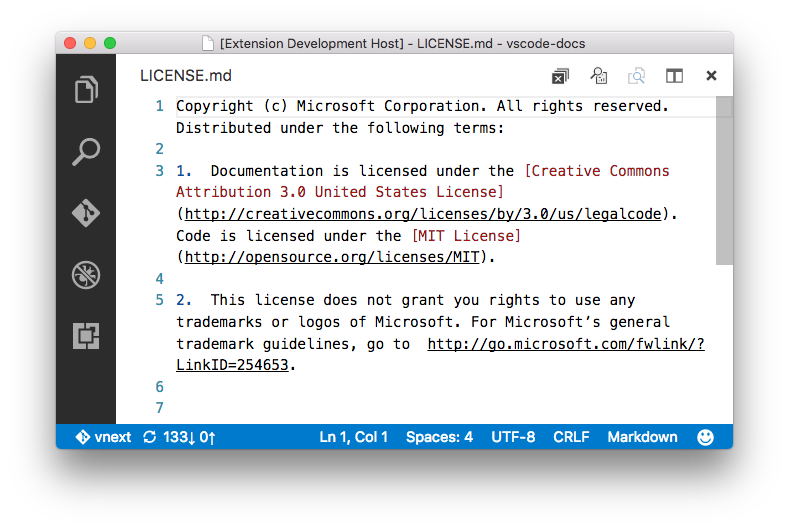

# README

## Features

This extension adds a new action to the editor group to close all editors of that group:

## Extension Settings

This extension does not need any settings.

## Known Issues

Currently it is not possible to show command actions for editor groups that are not active.

## Release Notes

Initial release.

### 1.0.0

Initial release